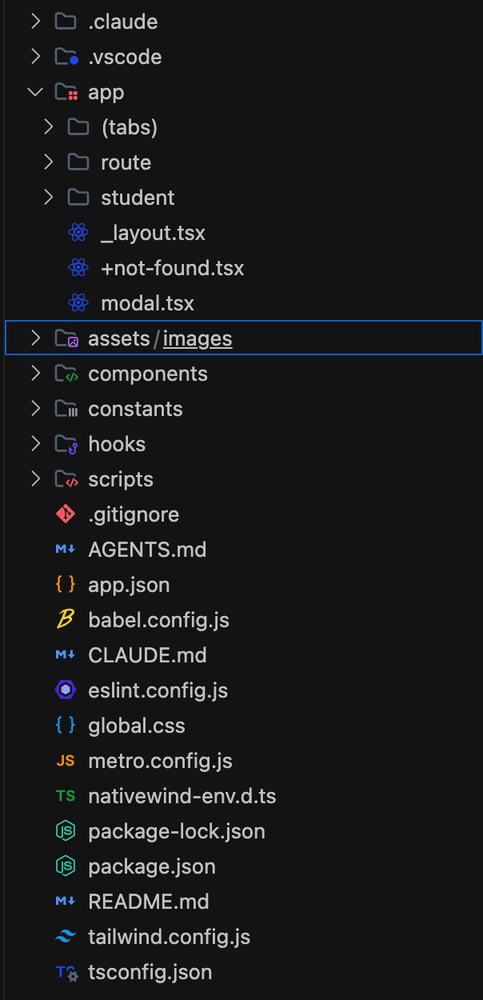

# Documento de Arquitectura y Navegación — RouteGo 🚐

Este documento detalla la arquitectura de navegación, wireframe y análisis comparativo técnico con Inteligencia Artificial del proyecto **RouteGo**, dando cumplimiento estricto a los criterios de entrega del curso.

---

## 1. Wireframe de Navegación

### Captura de Estructura de Archivos
Evidencia de la disposición de carpetas y archivos en el entorno de desarrollo:



### Diagrama del Flujo de Pantallas
El siguiente diagrama detalla la integración de los patrones de navegación (Stack raíz, Tab Navigator, pantalla Modal y Rutas Dinámicas):

```mermaid
flowchart TD
    subgraph RootStack ["app/_layout.tsx (Stack Principal)"]
        subgraph TabsGroup ["app/(tabs)/_layout.tsx (Tabs Navigator)"]
            TabHome["🏠 Inicio (index.tsx)\n- Estado de conexión\n- Próxima llegada shuttle\n- Accesos directos"]
            TabRoutes["🚌 Rutas (routes.tsx)\n- Catálogo Troncal/Circuito\n- Paradas en Riohacha\n- Frecuencia y estado"]
        end

        ModalScreen["🚐 Modal: Estado del Servicio (modal.tsx)\n- Flota activa (14 unidades)\n- Métricas de frecuencia (10-15m)\n- Botón Volver/Cerrar\npresentation: 'modal'"]

        DynamicStudent["🎓 Detalle Estudiante (student/[id].tsx)\n- Carné digital universitario\n- Extracción de ID dinámico\n- Código de barras interactivo\n- Botón Regresar"]

        DynamicRoute["🗺️ Detalle Ruta (route/[id].tsx)\n- Mapa interactivo de Riohacha\n- Paradas georreferenciadas\n- Telemetría en tiempo real\n- Botón Regresar"]
    end

    %% Conexiones
    TabHome -- "<Link href='/modal'>" --> ModalScreen
    TabHome -- "router.push('/student/ST-202688')" --> DynamicStudent
    TabHome -- "router.push('/student/ST-202714')" --> DynamicStudent
    TabRoutes -- "router.push('/route/R01')" --> DynamicRoute
    TabRoutes -- "router.push('/route/R02...')" --> DynamicRoute

    ModalScreen -.->|router.back()| TabHome
    DynamicStudent -.->|router.back()| TabHome
    DynamicRoute -.->|router.back()| TabRoutes
```

### Respuestas a las Preguntas de Diseño
1. **Pantallas principales en barra inferior (Tabs)**:
   - `Inicio` (`app/(tabs)/index.tsx`): Resumen operacional, estatus de red y accesos rápidos a carné y estado.
   - `Rutas` (`app/(tabs)/routes.tsx`): Directorio de las líneas de shuttles en Riohacha y paradas clave.
2. **Pantallas jerárquicas con botón de regreso (Stack)**:
   - `app/student/[id].tsx` y `app/route/[id].tsx`: Ambas cuentan con `headerShown: true` en el `<Stack/>` de `app/_layout.tsx` para brindar retorno nativo hacia el menú sin alterar el historial.
3. **Pantallas con contenido dinámico (`[id]`)**:
   - `app/student/[id].tsx`: Lee el identificador del carné del estudiante mediante `useLocalSearchParams` y lo imprime en pantalla.
   - `app/route/[id].tsx`: Lee el código de ruta para cargar las coordenadas georreferenciadas correspondientes.
4. **Flujo justificado como Modal**:
   - `app/modal.tsx`: Reporte del "Estado del Servicio". Justificado bajo `presentation: 'modal'` por ser información contextual de rápida lectura y descarte sin romper el flujo de navegación principal.

---

## 2. Explicación del Flujo

1. **Navegación Base**: La aplicación inicializa en el grupo de pestañas `(tabs)`, presentando la pantalla de *Inicio*.
2. **Conexión con el Modal**: Desde *Inicio*, un enlace declarativo `<Link href="/modal" asChild>` abre la pantalla modal de estado del servicio como una capa superpuesta sobre el Stack raíz.
3. **Conexión con la Ruta Dinámica**:
   - Desde *Inicio*, un botón programático dispara `router.push('/student/ST-202688')`, enviando el parámetro `id` a la pantalla `app/student/[id].tsx`.
   - Desde la pestaña *Rutas*, seleccionar una tarjeta dispara `router.push('/route/' + id)` hacia `app/route/[id].tsx`.
4. **Captura de Parámetros**: Las pantallas dinámicas consumen el hook `useLocalSearchParams<{ id: string }>()`, extrayendo el parámetro e imprimiéndolo en pantalla mediante `<Text>`.
5. **Retorno**: Todas las pantallas secundarias y modales disponen de botones de regreso mediante `router.back()` y cabeceras nativas de retroceso.

---

## 3. Comparativa Técnica (IA)

### Árbol de Carpetas Analizado
```text
routego-app
├── .gitignore
├── AGENTS.md
├── CLAUDE.md
├── README.md
├── app
│   ├── (tabs)
│   │   ├── _layout.tsx
│   │   ├── index.tsx
│   │   └── routes.tsx
│   ├── +not-found.tsx
│   ├── _layout.tsx
│   ├── modal.tsx
│   ├── route
│   │   └── [id].tsx
│   └── student
│       └── [id].tsx
├── app.json
├── assets
├── babel.config.js
├── captura.png
├── components
├── constants
├── eslint.config.js
├── global.css
├── hooks
├── metro.config.js
├── nativewind-env.d.ts
├── package-lock.json
├── package.json
├── scripts
├── tailwind.config.js
└── tsconfig.json
```

### Prompt de Arquitectura Utilizado
> *"Actúa como un Arquitecto Senior de Software en React Native. Analiza la estructura de archivos que utilicé para mi aplicación en Expo Router:*
>
> *[ÁRBOL DE CARPETAS PEGADO]*
>
> *Por favor:*
> 1. *Evalúa si mi separación de conceptos entre rutas y lógica de negocio es adecuada.*
> 2. *Propón una arquitectura alternativa profesional basada en el patrón Feature-First (creando una carpeta /src fuera de /app).*
> 3. *Explica 2 ventajas y 2 desventajas de migrar mi proyecto a esa arquitectura sugerida."*

### Análisis del Arquitecto Senior
1. **Evaluación de la separación de conceptos**:
   En la implementación actual, los archivos ubicados dentro de `app/` concentran la declaración de las rutas, la lógica de presentación de la interfaz y estructuras de datos estáticas (conocido como antipatrón *Fat Routes*). Las carpetas auxiliares (`components/`, `hooks/`, `constants/`) siguen una distribución horizontal (*Layer-First*) técnica que no agrupa las responsabilidades por dominio de negocio (transporte, estudiantes, métricas de servicio). Para una prueba de concepto o MVP inicial es rápido y práctico, pero en proyectos comerciales genera alto acoplamiento e imposibilita realizar pruebas unitarias aisladas sin inicializar el router.

2. **Propuesta Feature-First con `/src`**:
   Mantener `app/` como una capa mínima de enrutamiento (*Thin Routes*) que simplemente importe y renderice vistas ubicadas en módulos funcionales dentro de `src/features/`:
   - `src/features/transport/` (screens, components, hooks, services, types)
   - `src/features/students/` (screens, components, hooks, types)
   - `src/features/service-status/` (screens, components, types)
   - `src/shared/` (componentes UI transversales, tema, constantes comunes)

3. **Ventajas y Desventajas**:
   - **Ventaja 1 (Escalabilidad Modular)**: Los equipos de desarrollo pueden trabajar de manera autónoma en dominios independientes sin generar colisiones ni *merge conflicts* en los archivos de rutas de Expo Router.
   - **Ventaja 2 (Testabilidad y Aislamiento)**: Las vistas y hooks de negocio se vuelven componentes puros de React Native, fácilmente testeables con Jest y React Native Testing Library sin necesidad de simular el contexto de Expo Router.
   - **Desventaja 1 (Sobrecarga Inicial / Boilerplate)**: Incrementa considerablemente el número de archivos y carpetas, resultando excesivo para proyectos sencillos o entregas académicas acotadas.
   - **Desventaja 2 (Fricción por Indirección)**: Requiere navegar entre el archivo de ruta en `app/` y la pantalla real en `src/features/`, aumentando la carga cognitiva en modificaciones visuales puntuales.

### Conclusión Personal
> **Evaluación Crítica:**
> Aplicar la arquitectura *Feature-First* con separación estricta en una carpeta `/src` es la decisión más sensata y rentable en proyectos de React Native a gran escala o de nivel empresarial. Cuando una aplicación supera las diez pantallas, gestiona múltiples orígenes de datos y es mantenida por equipos multidisciplinarios, concentrar la lógica en las rutas de `app/` genera cuellos de botella severos, inconsistencias y fragilidad en las pruebas automatizadas. Aunque para un prototipo rápido implica una sobrecarga de *boilerplate*, en el largo plazo el patrón *Feature-First* protege la salud del código, garantiza un bajo acoplamiento, permite que los módulos crezcan de forma predecible y mantiene a Expo Router enfocado exclusivamente en lo que mejor sabe hacer: resolver el enrutamiento y la experiencia de transición nativa.
